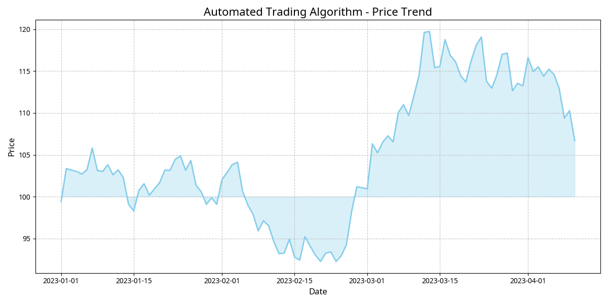
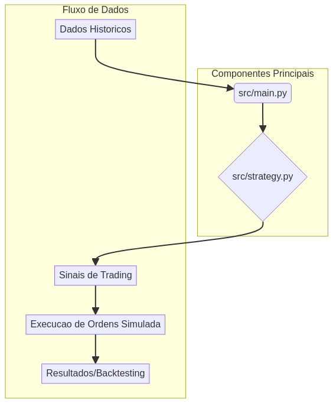

# automated-trading-algorithm-python


Este repositório contém um algoritmo de trading automatizado desenvolvido em Python.



## Estrutura do Projeto




- `src/`: Código fonte principal do algoritmo.
- `tests/`: Testes unitários para o código.
- `docs/`: Documentação do projeto.
- `data/`: Dados de exemplo ou históricos.
- `notebooks/`: Notebooks Jupyter para análise e experimentação.

## Instalação

1. Clone o repositório:
   ```bash
   git clone https://github.com/GabrielDemetriosLafis/automated-trading-algorithm-python.git
   cd automated-trading-algorithm-python
   ```
2. Crie e ative um ambiente virtual (opcional, mas recomendado):
   ```bash
   python -m venv venv
   source venv/bin/activate  # Linux/macOS
   .\venv\Scripts\activate   # Windows
   ```
3. Instale as dependências:
   ```bash
   pip install -r requirements.txt
   ```

## Uso

Para executar o algoritmo e visualizar os sinais de trading, você pode usar o script de exemplo:

```bash
python notebooks/example_usage.py
```

Este script irá buscar dados históricos simulados, aplicar a estratégia de cruzamento de médias móveis e plotar os resultados.


## Licença

Este projeto está licenciado sob a licença MIT. Veja o arquivo `LICENSE` para mais detalhes.

---

**Autor:** Gabriel Demetrios Lafis
