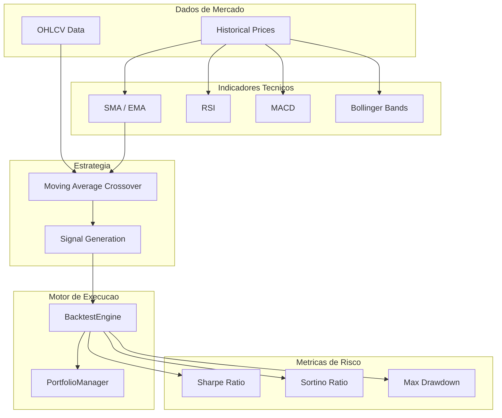
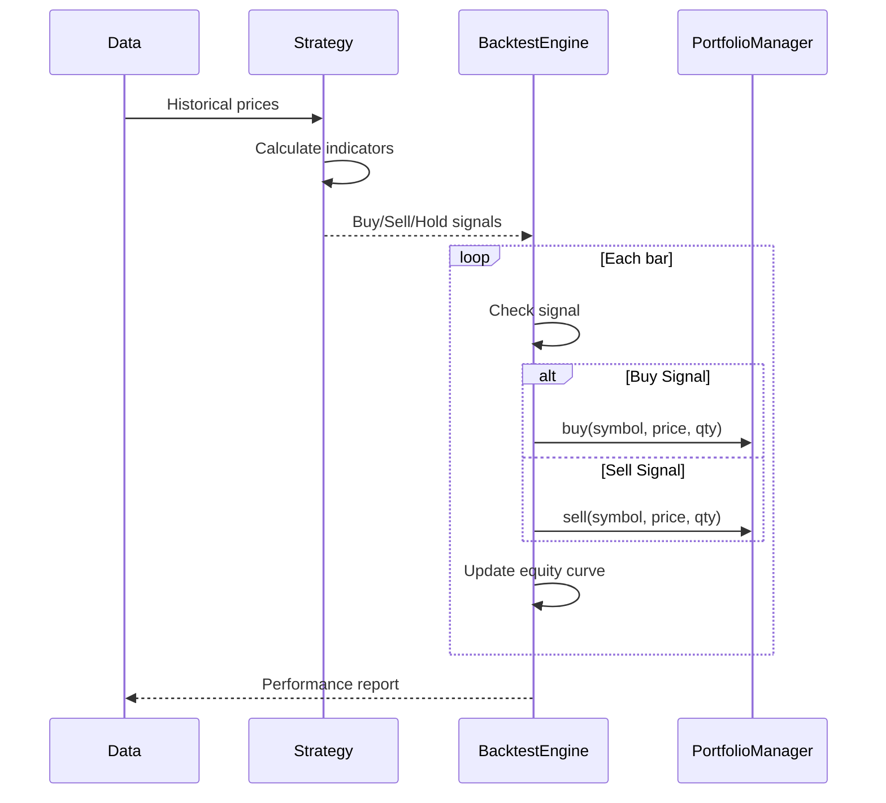

# Automated Trading Algorithm (Python)


Framework de algoritmos de trading automatizado. Motor de backtesting, indicadores tecnicos (SMA, EMA, RSI, MACD, Bollinger Bands), gerenciamento de portfolio, metricas de risco (Sharpe, Sortino, max drawdown) e simulacao de execucao de ordens.

Automated trading algorithm framework. Backtesting engine, technical indicators (SMA, EMA, RSI, MACD, Bollinger Bands), portfolio management, risk metrics (Sharpe, Sortino, max drawdown), and order execution simulation.

---

## Arquitetura / Architecture


```mermaid
graph TB
    subgraph Data["Dados de Mercado"]
        D1[Historical Prices]
        D2[OHLCV Data]
    end

    subgraph Indicators["Indicadores Tecnicos"]
        I1[SMA / EMA]
        I2[RSI]
        I3[MACD]
        I4[Bollinger Bands]
    end

    subgraph Strategy["Estrategia"]
        S1[Moving Average Crossover]
        S2[Signal Generation]
    end

    subgraph Engine["Motor de Execucao"]
        E1[BacktestEngine]
        E2[PortfolioManager]
    end

    subgraph Metrics["Metricas de Risco"]
        M1[Sharpe Ratio]
        M2[Sortino Ratio]
        M3[Max Drawdown]
    end

    D1 --> I1
    D1 --> I2
    D1 --> I3
    D1 --> I4
    D2 --> S1
    I1 --> S1
    S1 --> S2
    S2 --> E1
    E1 --> E2
    E1 --> M1
    E1 --> M2
    E1 --> M3
```

## Fluxo de Backtest / Backtest Flow


```mermaid
sequenceDiagram
    participant Data
    participant Strategy
    participant Engine as BacktestEngine
    participant Portfolio as PortfolioManager

    Data->>Strategy: Historical prices
    Strategy->>Strategy: Calculate indicators
    Strategy-->>Engine: Buy/Sell/Hold signals
    loop Each bar
        Engine->>Engine: Check signal
        alt Buy Signal
            Engine->>Portfolio: buy(symbol, price, qty)
        else Sell Signal
            Engine->>Portfolio: sell(symbol, price, qty)
        end
        Engine->>Engine: Update equity curve
    end
    Engine-->>Data: Performance report
```

## Funcionalidades / Features

| Funcionalidade / Feature | Descricao / Description |
|---|---|
| SMA / EMA | Medias moveis simples e exponencial / Simple and Exponential Moving Averages |
| RSI | Indice de Forca Relativa / Relative Strength Index |
| MACD | Convergencia/Divergencia de Medias Moveis / Moving Average Convergence Divergence |
| Bollinger Bands | Bandas de volatilidade / Volatility bands |
| BacktestEngine | Motor de simulacao de estrategias / Strategy simulation engine |
| PortfolioManager | Gerenciamento multi-ativo / Multi-asset portfolio management |
| Risk Metrics | Sharpe, Sortino, Max Drawdown |

## Inicio Rapido / Quick Start

```python
from src.main import fetch_historical_data
from src.strategy import MovingAverageCrossoverStrategy
from src.backtester import BacktestEngine
from src.indicators import rsi, macd

data = fetch_historical_data()
strategy = MovingAverageCrossoverStrategy(short_window=20, long_window=50)
signals = strategy.generate_signals(data)

engine = BacktestEngine(initial_capital=100000, commission=0.001)
result = engine.run(data["Close"].tolist(), signals["action"].tolist())
print(f"Return: {result['total_return']:.2%}")
print(f"Sharpe: {result['sharpe_ratio']:.4f}")
```

## Testes / Tests

```bash
pytest tests/ -v
```

## Tecnologias / Technologies

- Python 3.9+
- pandas, numpy
- pytest

## Licenca / License

MIT License - veja [LICENSE](LICENSE) / see [LICENSE](LICENSE).
